# Workbench

**One self-hosted web app for a hardware team:** chat, projects and task boards, design and code reviews linked to GitHub, products with several PCBs, enclosures and 3D CAD models, hardware block diagrams, firmware releases, PCB design files with a built-in Gerber viewer, a parts library with KiCad BOM import, purchasing, production builds, and timesheets.

Built for small embedded/electronics teams — especially **remote and distributed ones** — who are tired of stitching together Slack, Jira, a spreadsheet of parts and a shared drive. Everything is written in this codebase (no third-party apps embedded, no trackers, no CDNs), it runs as **one Docker container**, and everything it stores lives in **one `data` folder**.

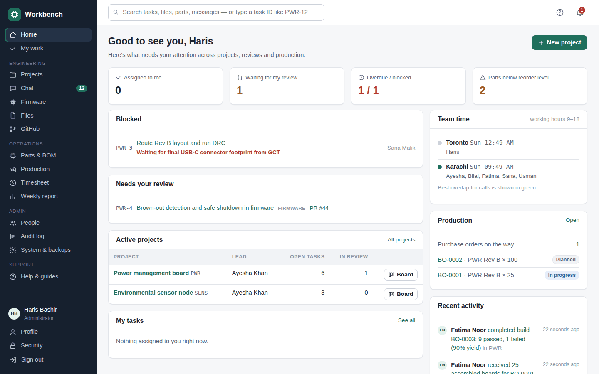

**Contents:**
[Features](#features) ·
[Install on a server](#install-on-a-server) ·
[Try it on your computer](#try-it-on-your-computer) ·
[Updating](#updating) ·
[Configuration](#configuration) ·
[File storage](#file-storage) ·
[Backups and restore](#backups-and-restore) ·
[Security](#security) ·
[Troubleshooting](#troubleshooting) ·
[Uninstall](#uninstall) ·
[Development](#development) ·
[License](#license)

---

## Features

### Projects and tasks
- A project per product, each with a **task board** (To do → In progress → In review → Done), a list view with filters, and an overview page.
- Task IDs like `PWR-12`, types (schematic, PCB layout, firmware, test…), priorities, due dates, reviewers, **blocked** flags with a reason, comments with **@mentions**, attachments, and time logging.

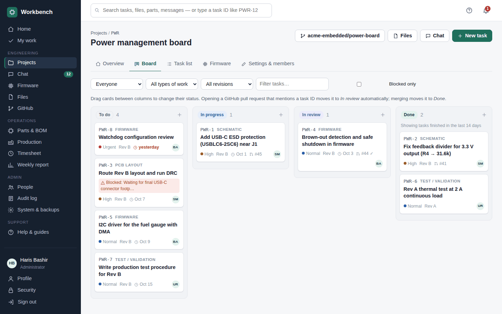

### Hardware: boards, enclosures and diagrams
Each product has a **Hardware** tab that holds everything physical about it.

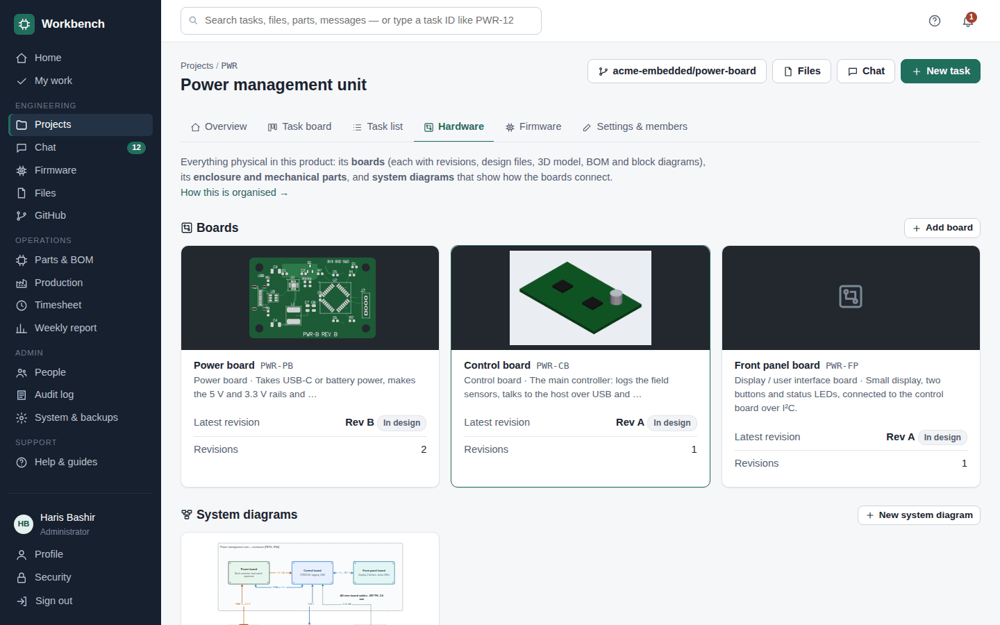

**Several boards per product.** A product can have any number of PCBs — for example a power board, a control board and a front panel board. Each board has its own **revisions** (Rev A, Rev B, EVT…), and each revision its own BOM, design files, 3D model, **release checklist** (ERC/DRC clean, MPNs complete, footprints checked…), builds and compatible firmware. Revisions are always shown with their board ("PWR Control board Rev A"), so tasks, builds and firmware point at the right PCB.

**3D models of boards.** Upload the 3D model KiCad exports (STEP, VRML or glTF) to a revision's design files and it's shown on the board and revision pages.

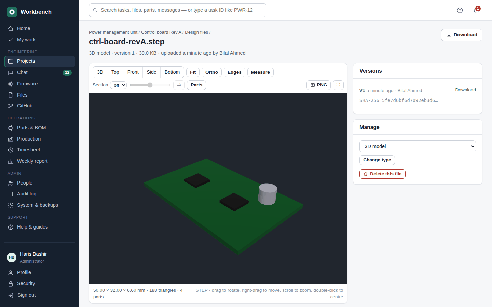

**Enclosures and mechanical parts.** Enclosures, lids, brackets, bezels, buttons, light pipes, gaskets and heatsinks — each with a revision letter, status (Concept → Prototype → Released → Obsolete), manufacturing process, material, finish, supplier, and the boards it holds. Upload the CAD source (SolidWorks, Fusion 360, Inventor, CATIA, Creo, FreeCAD…), STEP/3MF exports, print files and drawings; every upload of the same name becomes a new version with a SHA-256 checksum. Released parts are locked.

**Built-in 3D viewer** (written for this project, running in the browser with WebGL):
- Views **STEP / STP, IGES, STL, 3MF, OBJ, glTF / GLB and VRML**. Native files (SolidWorks `.sldprt`/`.sldasm`, Fusion 360 `.f3d`, Inventor, CATIA, Creo…) are stored and versioned; upload a STEP or 3MF export next to them to view them.
- Rotate, pan, zoom (mouse or touch), standard views (3D, top, front, side, bottom), orthographic mode, edges, **section cuts** along X/Y/Z to check how boards sit in the enclosure, **measure** between two points, show/hide parts of an assembly, and save a PNG.
- Large STEP files are converted in the background (with OpenCASCADE) and cached, so they open instantly afterwards.

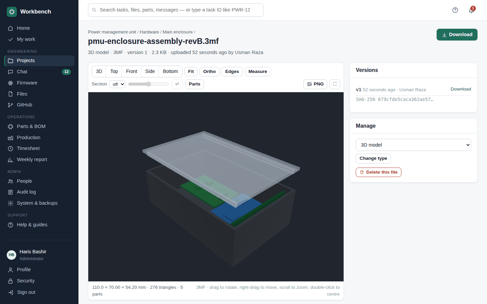

**Hardware block diagrams**, drawn in a built-in editor and saved with the product or board:
- Three levels, as hardware teams usually keep them: **System** (the whole product: its boards, external parts and the power, buses and cables between them), **High-level** per board (functional blocks) and **Detailed** per board (real ICs with part numbers, rails with voltages and currents, buses with addresses and pins).
- Start from a starter layout, a copy of another diagram, or an empty page.
- Shapes for blocks, ICs/MCUs, power, connectors, sensors, memory, batteries, external items, boards and group frames; connection types for **signal, power, ground, digital bus, high-speed/differential, analog, RF and cable**, each with its own colour and line style and a legend in exports.
- Drag to connect, align and distribute, undo/redo, keyboard shortcuts, and unsaved work kept in the browser.
- **Versions, review and approval:** submit for review, comment on the whole diagram or on one block, approve or ask for changes. Approved versions stay on record.
- **Exports:** PDF (A4 or A3, vector, with a title block: product, board, level, version, status, approver, author, date), SVG, PNG and JSON.

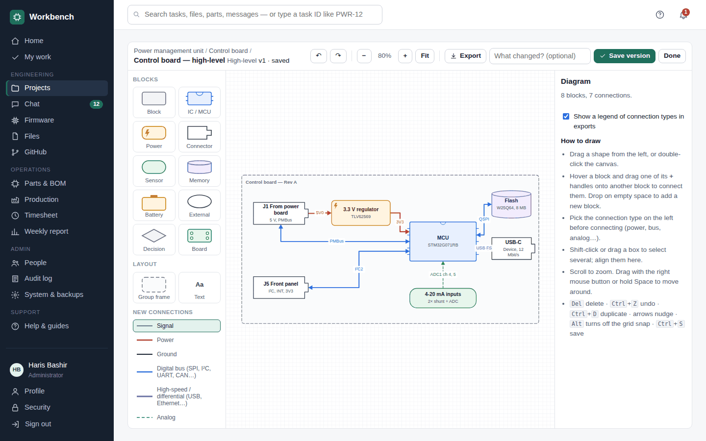

### Chat
- A channel for every project (created automatically), topic channels, private channels and **direct messages**.
- File sharing, @mentions, unread counts, task IDs that turn into links, and `code`/**bold**/heading formatting.
- GitHub activity, firmware releases and production updates are posted into the right project channel automatically.

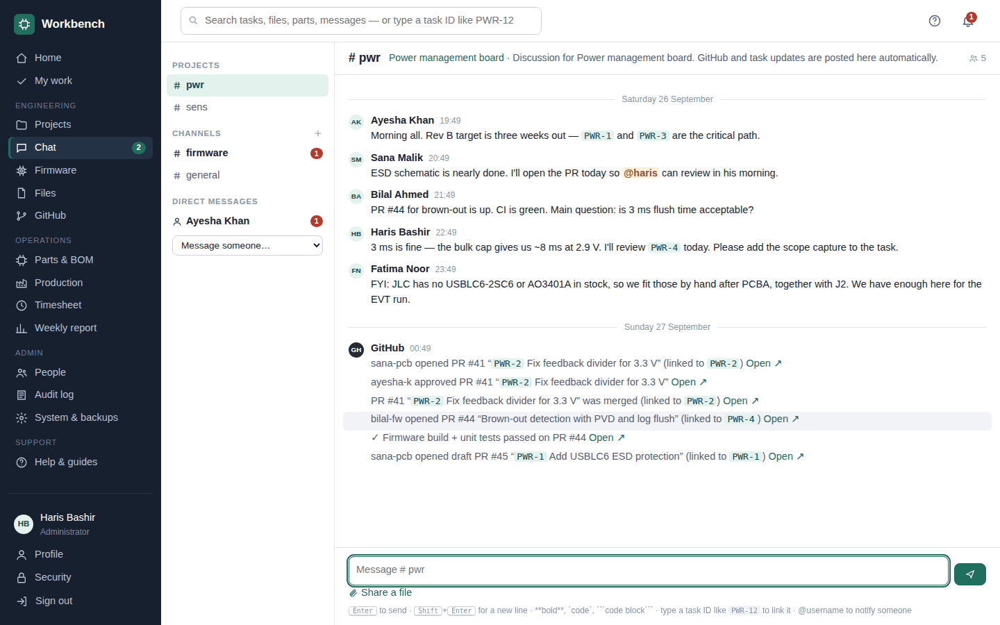

### GitHub integration
- One signed webhook per repository. Pull requests and commits that mention a task ID (`PWR-12`) are linked to the task.
- PR opened → task moves to *In review*; changes requested → *In progress*; merged → *Done*.
- CI results (e.g. KiBot ERC/DRC for hardware repositories, firmware builds) are shown on the task, and failures are announced in chat.
- Publishing a GitHub release (e.g. tag `v1.5.0`) creates a firmware release in *Testing* automatically.

### Firmware management
- Per project: firmware components (main application, bootloader…) with **semantic versions** (`1.4.0`, `1.4.0-rc.1`).
- Each release has notes, files (`.bin`, `.hex`, `.elf`…) with **SHA-256 checksums**, and the **board revisions it's compatible with** — so Rev A and Rev B can run different firmware.
- Lifecycle: Draft → Testing → **Released** (leads approve; files are locked) → Deprecated / **Recalled** (with a reason; the team is notified and builds using it are blocked).
- A recommended release per board revision, a **changelog between any two versions**, and a record of the firmware flashed on each production build.

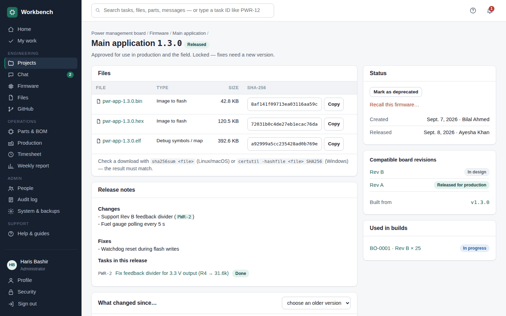

### PCB design files and Gerber viewer
- Each board revision stores its **Gerbers, drill files, schematic and PCB files** (KiCad, Eagle, Altium), pick-and-place, BOM, 3D models and PDFs — sorted by type, every version kept.
- A **built-in Gerber and Excellon viewer** (its own renderer, nothing external): top and bottom views with solder mask colour and finish, a layer view with toggles, zoom, pan and a **measure** tool.
- Board facts for ordering: size, copper layers, thickness and finish (from the job file), hole counts, smallest drill, thinnest track.

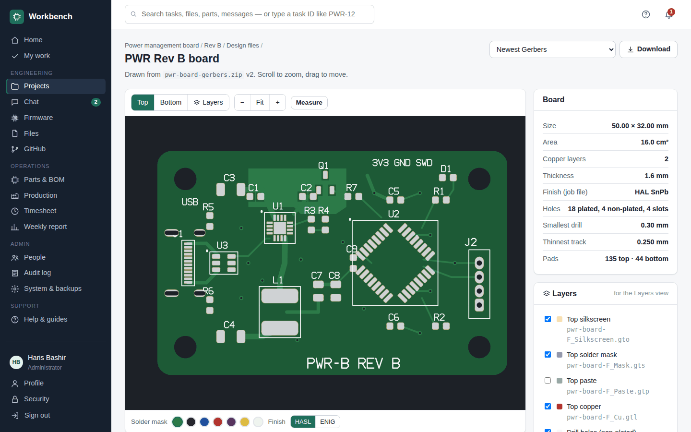

### Parts and BOMs
- Parts library with categories, MPNs, suppliers, prices, stock, reorder levels, storage locations and full **stock history**.
- **KiCad BOM import** (KiCad or KiBot CSV) with automatic part matching; BOM cost per board, boards buildable from stock, and **BOM comparison between revisions**.
- Each BOM line is marked as fitted by the **assembly house**, **in house** or **not fitted** (through-hole parts are suggested as in house).

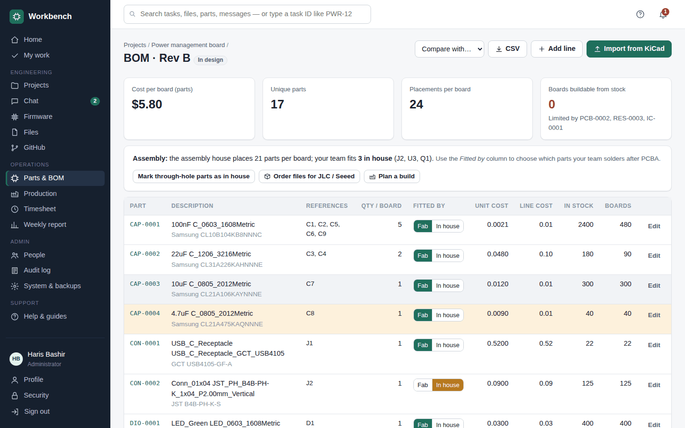

### Purchasing and production
- **Purchase orders:** draft → ordered → received; receiving updates stock and unit cost. One click creates orders for exactly the parts a build is short of, grouped by supplier.
- **Builds done fully in house:** shortage check, parts taken from stock, test yield.
- **Builds assembled by JLCPCB, Seeed or another assembly house, then finished in house:**
  - *Order files*: the assembler's BOM and placement (CPL) files with your in-house parts left out, plus the Gerbers, with checks for missing LCSC numbers or placements.
  - Track the order number and dates; when the boards arrive, only the in-house parts leave stock.
  - The build becomes a **finishing checklist** — one step per in-house part, highlighted on the board picture, with *+1 / +5 / All* counters that work on a phone at the bench — plus a **printable traveler** with a tick box per board.
  - Then test & flash, and record passed/failed boards.

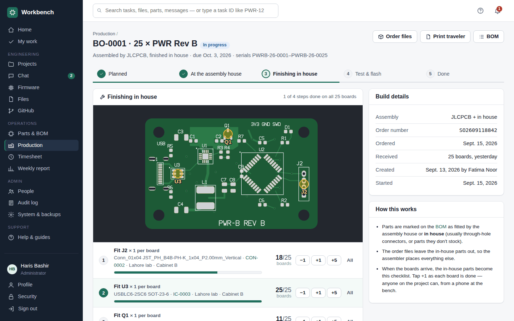

### Files
- A file space per project plus a company-wide *Shared* space, with folders, drag-and-drop upload, **every version kept**, previews (PDF, images, text, CSV, KiCad files), a trash with restore, and a storage page showing what takes space.

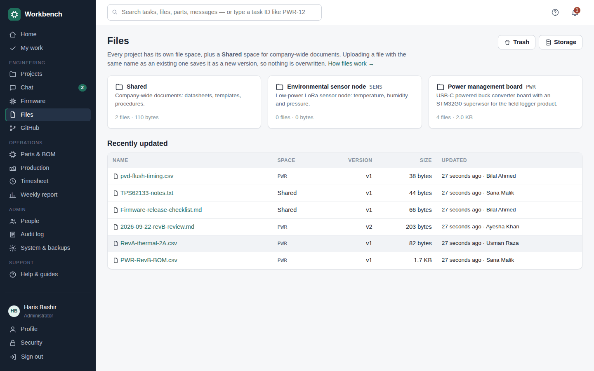

### Time, reporting and search
- Log hours against tasks; a **weekly report** of hours by person and project, finished work, reviews, blockers and builds — printable, or as CSV.
- **Home** shows your tasks, reviews waiting for you, blocked and overdue work, low stock, and a **team clock** showing who's in working hours (e.g. Toronto ↔ Karachi).
- One search box for tasks, files, parts and messages; type a task ID like `PWR-12` to jump straight to it. Notifications in the app and by email.

### Administration
- Five roles: **Administrator**, **Engineering lead**, **Engineer**, **Procurement / production**, **Viewer** (read-only). Engineers only see their projects.
- Invite links (or emailed invites), company name and **logo** (SVG or transparent PNG), time zone, SMTP email, GitHub webhook secret.
- **Storage settings in the app**: a folder on the server or S3-compatible cloud storage, with a verified background move.
- Nightly **backups**, restore from the command line, **"Download everything"** as an organised zip (with a *Hardware* folder per product: boards, revisions, design files, 3D models, block diagrams as PDF and SVG, and mechanical parts), and an **audit log** of sign-ins, permission changes, downloads and stock changes.
- **Help & guides** built in, and a short explanation on every page.

---

## Install on a server

The commands below can be copied as they are.

### What you need

- A server running **Ubuntu 22.04 / 24.04 or Debian 12**, with at least **2 GB RAM and 20 GB disk**, and a user that can run `sudo`. A small cloud VM (AWS Lightsail/EC2, DigitalOcean, Hetzner, Linode…) is enough for a team of 20.
- For access over the internet: a **domain name** (e.g. `workbench.yourcompany.com`) with a DNS **A record** pointing at the server's public IP. Check it before you start — this must print your server's IP:
  ```bash
  getent hosts workbench.yourcompany.com
  ```
- No domain? Workbench can run over plain HTTP on port 8000. Only do that inside an office network, a VPN or Tailscale.

### Step 1 — Log in and open the firewall

```bash
ssh you@SERVER-IP
sudo apt update && sudo apt install -y curl
sudo ufw allow OpenSSH
sudo ufw allow 80
sudo ufw allow 443
sudo ufw --force enable
```

Without a domain, also run `sudo ufw allow 8000`. If your cloud provider has its own firewall (AWS security groups, DigitalOcean/Hetzner firewalls…), open the same ports there too.

### Step 2 — Install

```bash
bash <(curl -fsSL https://raw.githubusercontent.com/harisbashir/workbench/main/install.sh) https://github.com/harisbashir/workbench.git
```

The installer:

1. installs git and Docker if they're missing
2. downloads the newest release (the highest `v…` tag) into `/opt/workbench`
3. asks for your **domain** — type it for automatic HTTPS with a free Let's Encrypt certificate, or leave it empty to use `http://SERVER-IP:8000`
4. builds and starts Workbench (the first build takes a few minutes)
5. prints the address and a one-time **setup code**

Installer options (add them at the end of the command):

| Option | What it does |
|---|---|
| `--domain workbench.yourcompany.com` | Use this domain without asking |
| `--no-https` | Don't ask; run on `http://SERVER-IP:8000` |
| `--dir /srv/workbench` | Install somewhere other than `/opt/workbench` |
| `--branch main` | Follow the latest code on a branch instead of release tags (for test servers) |

Installing from a **fork** or a **private copy**? Pass its address instead. For a private repository, use the SSH address (`git@github.com:you/workbench.git`): the installer creates a **read-only deploy key**, shows it, and waits while you add it in GitHub under *Repository → Settings → Deploy keys* (leave *Allow write access* off).

### Step 3 — First sign-in

1. Open the address the installer printed.
2. Enter the setup code. Lost it? Run:
   ```bash
   cd /opt/workbench && docker compose logs workbench | grep -i "setup code"
   ```
3. Create your administrator account and scan the QR code with an authenticator app (Google Authenticator, Microsoft Authenticator, 1Password…). **Save the recovery codes** somewhere safe.

### Step 4 — Set it up

Go to **System & backups**:

| Tab | What to do |
|---|---|
| General | Company name, **Site url** (e.g. `https://workbench.yourcompany.com`, used in invite and email links), time zone, logo |
| Storage | Keep files on the server, or move them to cloud storage (see [File storage](#file-storage)) |
| Backups | Check the nightly backup time. Download a backup now and then and keep it off the server |
| Email | SMTP details so invites and notifications can be emailed, then *Send me a test email* |
| GitHub | Copy the webhook address and secret into each repository: *Repository → Settings → Webhooks → Add webhook*, content type `application/json` |

Then create your projects and invite your team under **People → Invite**. **Help & guides** (the `?` at the top of every page) walks new users through everything.

### Step 5 — Check it's healthy

```bash
cd /opt/workbench
docker compose ps                         # "workbench" should say (healthy)
curl -s http://localhost:8000/healthz     # {"ok": true, ...}
```

Point an uptime monitor (UptimeRobot, Healthchecks…) at `https://your-domain/healthz`.

---

## Try it on your computer

You need [Docker Desktop](https://docs.docker.com/get-docker/) (Windows, Mac) or Docker (Linux).

```bash
git clone https://github.com/harisbashir/workbench.git
cd workbench
docker compose up -d
docker compose logs workbench        # shows the one-time setup code
```

Open **http://localhost:8000**, enter the setup code and create your account.

To explore with example data instead — projects, tasks, chat, parts, firmware, a product with three boards, board 3D models, an enclosure, block diagrams and builds — load the demo **instead of** creating your own account:

```bash
docker compose exec workbench manage seed_demo
```

Then sign in as `haris` (administrator), `ayesha` (lead), `bilal`, `sana` or `usman` (engineers) or `fatima` (procurement), all with the password `Workbench-demo-2026!`. The demo is for trying things out — don't load it on a real installation.

Stop it with `docker compose down`. Your data stays in the `data` folder.

---

## Updating

### Servers installed with the installer

```bash
cd /opt/workbench
./update.sh --check       # is there a new version? (lists the changes)
./update.sh               # update
./update.sh --to v1.3.3   # go to a specific newer version
```

`update.sh`:

1. takes a backup (`data/backups/…`)
2. downloads the new version from GitHub
3. builds it while the current version keeps running
4. restarts and waits for the health check
5. **if the new version doesn't come up healthy, puts the previous version back and restores the backup**

Workbench is unavailable for about a minute during step 4. Everything is logged in `data/update.log`. Database changes are applied automatically when the new version starts.

### Older installations (set up with `git clone` before version 1.3)

These don't have `update.sh` yet. Update once by hand, then use `./update.sh` from then on:

```bash
cd ~/workbench                                                         # wherever you cloned it
docker compose exec workbench manage backup_now                        # safety backup
git remote set-url origin https://github.com/harisbashir/workbench.git
git pull
docker compose up -d --build            # with a domain: docker compose --profile https up -d --build
docker compose ps                       # wait for (healthy)
chmod +x install.sh update.sh
```

If `git pull` complains about local changes, run `git stash` and try again.

### Upgrading to 1.4

Version 1.4 adds boards to products. Existing revisions are moved onto a board called **Main board** in each project automatically; rename it, or add more boards, under the project's **Hardware** tab. Updating takes a little longer than usual the first time, because the container installs the 3D converter.

### Which version does a server get?

Servers installed with the installer follow **release tags** (`v1.3.3`), so unfinished work on `main` never reaches them. A server installed with `--branch main`, or an older `git clone`, follows `main` directly — handy for a test server.

---

## Configuration

Most settings are made in the app (**System & backups**). A few server settings go in a `.env` file in the Workbench folder (`/opt/workbench/.env`). After changing it, apply with `docker compose up -d` (with a domain: `docker compose --profile https up -d`). Workbench generates its own secret keys on first start — there's nothing you have to set.

| Variable | Default | What it does |
|---|---|---|
| `WORKBENCH_DOMAIN` | *(empty)* | Your domain. Turns on HTTPS mode (secure cookies, HSTS); the `https` profile gets a certificate for it |
| `WORKBENCH_BIND` | `0.0.0.0` | Address the app port listens on. The installer sets `127.0.0.1` with a domain, so only the HTTPS proxy is reachable |
| `WORKBENCH_PORT` | `8000` | Port on the server for the app |
| `WORKBENCH_WORKERS` | `3` | Web server processes (each runs 4 threads) |
| `WORKBENCH_TIME_ZONE` | `UTC` | Server default time zone (the company time zone is set in the app) |
| `WORKBENCH_SESSION_HOURS` | `12` | How long people stay signed in |
| `WORKBENCH_LOGIN_MAX_ATTEMPTS` / `WORKBENCH_LOGIN_LOCKOUT_MINUTES` | `5` / `15` | Account lockout after wrong passwords |
| `WORKBENCH_ALLOWED_HOSTS` / `WORKBENCH_CSRF_TRUSTED_ORIGINS` | | Extra addresses, when Workbench sits behind another proxy or load balancer |
| `WORKBENCH_DB_NAME`, `_USER`, `_PASSWORD`, `_HOST`, `_PORT` | | Use an existing **PostgreSQL** server instead of the built-in SQLite database (only needed for large teams) |
| `WORKBENCH_STORAGE`, `WORKBENCH_S3_*`, `WORKBENCH_FILES_DIR` | | Pin file storage in the server configuration instead of the app (see `.env.example`) |

See [`.env.example`](.env.example) for a commented template.

---

## File storage

Administrators choose where uploaded files are kept in **System & backups → Storage**:

- **A folder on the server** — the default (`data/files`). It can point at a bigger disk or a NAS share mounted into the container.
- **Cloud storage over the S3 protocol** — **Amazon S3, Cloudflare R2, Backblaze B2, Wasabi, DigitalOcean Spaces, Google Cloud Storage** (HMAC keys), or your own **MinIO / Synology / QNAP** S3 server. Choose the service and its address is filled in.

To switch:

1. Create a **private** bucket and an access key limited to it. It needs to list, read, write and delete objects. On AWS, an IAM role on the server works without keys.
2. Enter the details and press **Save and test connection** — Workbench writes, reads back and deletes a test file.
3. Press **Move files and switch**. Every file is copied and checked in the background; Workbench switches only when all of them made it, and people can keep working meanwhile. Nothing is deleted from the old place.
4. With **Lock storage here** ticked (the default), the choice is permanent in the app — only the keys for the same bucket can be updated. To change it anyway, an administrator runs `docker compose exec workbench manage storage --unlock` on the server.

Keys are stored encrypted, buckets stay private, and files are always downloaded through Workbench, so permissions apply wherever they're kept. With cloud storage, nightly backups still include every file, and a copy of each backup is also kept in the bucket under `backups/`.

---

## Backups and restore

Everything lives in the `data` folder next to `docker-compose.yml`:

| Folder / file | What's in it |
|---|---|
| `data/db/` | The database (SQLite, a single file) |
| `data/files/` | Uploaded files, when they're stored on the server |
| `data/backups/` | Backup zips |
| `data/secrets.json` | Generated keys. They're needed to read 2FA and other encrypted settings — **never lose this file** |
| `data/update.log` | What `update.sh` did |

- **Automatic:** a backup every night (time set in *System & backups → Backups*); the newest 14 are kept. Each zip holds the database, all files and the keys.
- **Right now:** press *Back up now*, or run `docker compose exec workbench manage backup_now`.
- **Off the server:** download backups from the Backups page, or sync `data/backups` somewhere else (with cloud storage, copies are already in your bucket). **Always keep a copy off the server.**
- **Restore:**
  ```bash
  cd /opt/workbench
  docker compose stop workbench
  docker compose run --rm workbench restore workbench-YYYYMMDD-HHMMSS.zip
  docker compose start workbench
  ```
  The data from just before the restore is kept in `data/pre-restore-…` until you delete it.
- **Move to a new server:** install on the new server (above), then run `docker compose stop workbench` on both, copy the old server's `data` folder over the new one, and run `docker compose start workbench`.
- **Download everything:** *System & backups → Download everything* builds one zip organised for people rather than for restoring: every file in its folders, each firmware release with its files and notes, BOMs, tasks, parts, orders and builds as spreadsheets, and transcripts of public chat channels. Private channels, direct messages and keys are left out. Use it for handovers, audits or archives.

---

## Security

- **Sign-in:** passwords of 12+ characters plus **mandatory authenticator-app 2FA**, single-use recovery codes, and account lockout after repeated wrong passwords.
- **Access control:** five roles; engineers only see their projects; released revisions and released firmware are locked; every page and download is permission-checked on the server.
- **Data at rest:** 2FA secrets, SMTP passwords, webhook secrets and storage keys are encrypted in the database. Uploaded files are never served directly, and files that could run in a browser (`.html`, `.js`, `.exe`…) are refused. Uploaded SVG logos are cleaned before use.
- **In the browser:** HTTPS with HSTS (with a domain), secure cookies, CSRF protection and a strict Content-Security-Policy. No third-party scripts, fonts or trackers.
- **GitHub webhooks:** HMAC-SHA256 signatures, replay protection, and capped logging of rejected requests.
- **Audit log:** sign-ins (including failures), permission changes, uploads, downloads, backups, imports, stock changes and orders, each with its IP address.
- **Server:** the container runs as an unprivileged user; the installer verifies GitHub's host key when it uses a deploy key; updates take a backup first and roll back automatically.

Found a security problem? Please report it privately through this repository's **Security → Report a vulnerability** page on GitHub, not in a public issue.

---

## Troubleshooting

Run these on the server, in the Workbench folder (`/opt/workbench`, or wherever you cloned it). With a domain, add `--profile https` to `docker compose up` and `down` so the HTTPS proxy (Caddy) is included; `ps`, `logs`, `exec` and `restart` work without it.

### First look

```bash
cd /opt/workbench
docker compose ps                                    # is it running and (healthy)?
docker compose logs --tail 100 workbench             # recent log of the app
docker compose logs -f workbench                     # follow the log live (Ctrl+C to stop)
curl -s http://localhost:8000/healthz                # {"ok": true, "database": true, "disk_free_mb": ..., "scheduler_seen": ..., "version": ...}
tail -n 50 data/update.log                           # what the last updates did
docker compose exec workbench manage check --deploy  # configuration check
```

- `/healthz` says `"ok": false` when the database can't be reached or less than 200 MB of disk is free.
- `scheduler_seen` is the last time the background worker (nightly backups, emails, exports, storage moves) checked in. It should be within the last minute or two.
- Without a domain, `check --deploy` warns about secure cookies and HSTS; that's expected on plain HTTP.

### Common problems

| Symptom | Likely cause | Fix |
|---|---|---|
| The browser can't connect at all | Firewall, or the container isn't running | `docker compose ps`; open ports 80/443 (or 8000) in `ufw` **and** in your cloud provider's firewall; `docker compose up -d` |
| HTTPS certificate error, or the domain doesn't load | DNS doesn't point at the server yet, or ports 80/443 are closed, so Let's Encrypt couldn't verify | `getent hosts your-domain` must show the server's IP; then `docker compose --profile https restart caddy` and check `docker compose logs caddy` |
| **Bad Request (400)** | Opening by IP address while a domain is set | Use the domain name, or change the domain (see below) |
| **CSRF verification failed** when signing in | Workbench is behind another proxy or load balancer with a different address | Add `WORKBENCH_CSRF_TRUSTED_ORIGINS=https://the-address` and `WORKBENCH_ALLOWED_HOSTS=the-address` to `.env`, then `docker compose up -d` |
| Invite or email links point to the wrong address | *Site url* not set | *System & backups → General → Site url* |
| Port 8000 is already in use | Another program uses it | Set `WORKBENCH_PORT=8080` in `.env`, then `docker compose up -d` |
| Container restarts over and over | A startup error | `docker compose logs --tail 200 workbench` — the error is at the end |
| Nightly backups or "Download everything" don't happen | The background worker stopped | `docker compose restart workbench`; check `scheduler_seen` in `/healthz`; run one pass by hand with `docker compose exec workbench manage run_scheduler --once` |
| Uploads fail, or "disk full" | Disk or cloud storage problem | `df -h` and `du -sh data/*`; *Files → Storage* to delete old versions and empty the trash; `docker system prune` removes old Docker images; `docker compose exec workbench manage storage --test` checks cloud storage |
| Emails don't arrive | SMTP settings | *System & backups → Email → Send me a test email* — the reason is shown on the page |
| GitHub events don't show up | Webhook address or secret | In GitHub, *Repository → Settings → Webhooks → Recent deliveries* shows each attempt and the response. The address and secret must match *System & backups → GitHub* |
| `./update.sh: Permission denied` | The script lost its "executable" flag | `chmod +x install.sh update.sh`, or run `bash update.sh` |
| `update.sh` says "Couldn't reach GitHub" | Network, or the wrong repository address | `git remote -v`; `git remote set-url origin https://github.com/harisbashir/workbench.git` |
| `update.sh` says files were changed on the server | Someone edited files in the folder | `git status` to see them; `git stash` to set them aside (or `git checkout -- .` to throw them away) |

### Locked out

```bash
docker compose exec workbench manage reset_account --list               # all accounts; shows LOCKED ones
docker compose exec workbench manage reset_account haris                # unlock after too many wrong passwords
docker compose exec workbench manage reset_account haris --password     # also print a one-time link to set a new password
docker compose exec workbench manage reset_account haris --2fa          # also turn off 2FA (set up again at next sign-in)
docker compose exec workbench manage create_admin --username newadmin   # a new administrator, with a set-password link
```

Replace `haris` with the username. Every reset is written to the audit log. Administrators can also unlock people and reset their 2FA under **People**.

### Change the domain later (or add one)

```bash
cd /opt/workbench
./install.sh              # asks for the domain again and restarts
```

Or by hand: set `WORKBENCH_DOMAIN=` and `WORKBENCH_BIND=127.0.0.1` in `.env`, then run `docker compose --profile https up -d`.

### Go back to the previous version

`update.sh` does this by itself when an update fails. To do it by hand — for example, the new version starts but something doesn't work right:

```bash
cd /opt/workbench
ls -t data/backups | head -3          # the newest is the backup update.sh took before updating
git tag --sort=-v:refname | head -5   # versions
git checkout v1.3.2                   # the version you were on before
docker compose stop workbench
docker compose run --rm workbench restore workbench-YYYYMMDD-HHMMSS.zip
docker compose up -d --build
```

Always restore the backup together with the old version: a newer version may have changed the database, and an older version can't read it. Anything added since that backup is lost.

### Useful commands

```bash
docker compose exec workbench manage backup_now          # backup now
docker compose exec workbench manage storage             # where files are kept, locked or not
docker compose exec workbench manage storage --test      # write/read/delete a test file
docker compose exec workbench manage storage --unlock    # allow changing locked storage again
docker compose exec workbench manage shell               # Python shell with Workbench loaded (careful)
docker compose restart workbench                         # restart the app
docker compose build --no-cache && docker compose up -d  # rebuild from scratch
docker stats --no-stream                                 # CPU and memory use
```

Never set `WORKBENCH_DEBUG=1` on a server: it shows internal details to anyone who hits an error. Use the logs instead.

### Asking for help

Open an issue on GitHub with the output of these (they contain no passwords or keys):

```bash
cat VERSION; git log --oneline -1
docker compose ps
curl -s http://localhost:8000/healthz
docker compose logs --tail 200 workbench
tail -n 50 data/update.log
```

---

## Uninstall

```bash
cd /opt/workbench
docker compose --profile https down      # stop and remove the containers
```

That leaves your data in `/opt/workbench/data`. **Download a backup first** if you might want it later. To remove everything, including all data:

```bash
sudo rm -rf /opt/workbench
docker image rm workbench:latest caddy:2
```

---

## Development

Workbench is a [Django](https://www.djangoproject.com/) 5 app with server-rendered pages and hand-written CSS and JavaScript (no frontend framework, no build step). The Gerber viewer, 3D viewer and diagram editor are written from scratch; STEP/IGES files are converted with OpenCASCADE through [`cascadio`](https://pypi.org/project/cascadio/). The database is SQLite by default (PostgreSQL optional); files go through Django's storage API (local disk, or S3 via `django-storages`).

```bash
git clone https://github.com/harisbashir/workbench.git && cd workbench
python3 -m venv .venv && source .venv/bin/activate
pip install -r requirements-dev.txt
export WORKBENCH_DEBUG=1
python manage.py migrate && python manage.py seed_demo
python manage.py runserver                     # http://localhost:8000 — haris / Workbench-demo-2026!
python manage.py test apps                     # 172 tests (S3 is tested against a local mock)
ruff check apps config --select F,E9           # lint
```

### Workflow

- `main` is always deployable. Work on a branch (e.g. `pwr-14-export-po-pdf`) and open a pull request.
- CI (`.github/workflows/ci.yml`) runs the linters (Python and the shell scripts), the tests, Django's production security check, a container build with a health check, and a dependency audit.
- Database changes go in migrations (`python manage.py makemigrations`), committed with the code. They're applied automatically when a server starts the new version.

### Releasing a version

```bash
echo 1.3.4 > VERSION
git commit -am "Release 1.3.4"
git tag -a v1.3.4 -m "Workbench 1.3.4"
git push origin main --tags
```

Servers pick it up with `./update.sh`. The tag also triggers `.github/workflows/release.yml`, which publishes a ready-made image to GitHub Container Registry.

### Project layout

```
config/              settings (zero-config: data folder, generated secrets, storage)
apps/accounts/       users, roles, 2FA, invites, lockout
apps/core/           dashboard, search, notifications, audit log, help, setup wizard,
                     system page, backups, export, storage, logo, scheduler, email
apps/projects/       projects, boards, revisions and release checklists, tasks, activity
apps/chat/           channels, messages, file sharing
apps/files/          file library: spaces, folders, versions, trash, storage
apps/firmware/       firmware components, releases, artifacts
apps/design/         revision design files, Gerber/Excellon parser and board renderer
apps/cad/            3D formats (STEP, IGES, STL, 3MF, OBJ, glTF, VRML), mesh cache, thumbnails
apps/mechanical/     enclosures and mechanical parts with versioned CAD files
apps/diagrams/       block diagrams: layout engine, versions, review, SVG/PDF export
apps/inventory/      parts, suppliers, stock, BOMs, KiCad import
apps/production/     purchase orders, builds, assembly-house files, finishing
apps/timesheets/     time entries, weekly report
apps/integrations/   GitHub webhook
templates/ static/   UI (hand-written CSS and JavaScript, WebGL 3D viewer, diagram editor)
docs/                screenshots, sample BOM, KiBot setup for hardware repositories
Dockerfile docker-compose.yml docker-entrypoint.sh deploy/
install.sh update.sh server install and safe updates
```

Hardware repositories can run ERC/DRC and produce fabrication files in CI with [KiBot](https://github.com/INTI-CMNB/KiBot): copy [`docs/examples/kibot.yml`](docs/examples/kibot.yml) to `.github/workflows/` and [`docs/examples/.kibot.yaml`](docs/examples/.kibot.yaml) to the repository root. The results show up on the linked Workbench tasks.

---

## Contributing

Issues and pull requests are welcome. For a change of any size, open an issue first to talk it through. Please include tests for new behaviour and make sure `python manage.py test apps` and the linter pass.

## License

Workbench is released under the [MIT License](LICENSE). Copyright © 2026 Haris Bashir.
